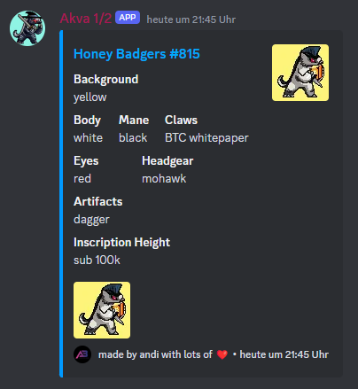

# Honey Badgers Discord Bot

The Honey Badgers Discord Bot is designed to show these awesome badgers with traits and inscription number.
Honey Badgers are the first 10k collection on Bitcoin!
This bot is tailored specifically for the ([@HoneyBadgers](https://twitter.com/HoneyBadgersBtc)) community.

Users can call the bot like this: !815



## Invite Bot to Discord

### Adding the Existing Bot to a Discord Server

To add the existing HoneyBadgers Discord Bot to your server, you need to have the correct permissions on Discord. Make sure you are logged in to your Discord account and have administrative permissions on the server where you want to add the bot. Here’s how you can do it:

1. **Open the Discord Application or Website:** Log in to your account.

2. **Invite the Bot:** Paste the ([Bot](https://discord.com/oauth2/authorize?client_id=1211699777054449747&permissions=51200&scope=bot)) link into your web browser, select the server to which you want to add the bot from the dropdown list, and click on the ‘Authorize’ button. You may be prompted to confirm that you are not a robot.

3. **Verify Bot Presence:** Go to your Discord server to ensure that the bot has been added successfully and is online.

By following these steps, you can easily add the HoneyBadgers Discord Bot to any server for which you have the necessary permissions, enabling you to start using the bot’s features immediately.

## Run Bot yourself

Follow these instructions to get your bot up and running on your server.

### Prerequisites

- Node.js installed on your server ([Download Node.js](https://nodejs.org/))
- A Discord account and a server where you can add bots

### Installation

1. **Clone the Repository**

Start by cloning the repository to your local machine or server:

```bash
git clone https://github.com/aberghammer/badger_bot.git
cd badger_bot
```

2. **Install Dependencies**

Install all the necessary dependencies using npm:

```bash
npm install
```

3. **Create an Environment File**

Create a `.env` file in the root directory of your project and fill it with your Discord bot token:

```
BOT_TOKEN=your-discord-bot-token-here
```

You can obtain a bot token by creating an application in the [Discord Developer Portal](https://discord.com/developers/applications).

4. **Run the Application**

Launch the bot by running:

```bash
node ./bot.js
```

Ensure that your bot is online and connected to your Discord server.

### Inviting the Bot to Your Server

To invite the bot to your Discord server, follow these steps:

1. Navigate to the [Discord Developer Portal](https://discord.com/developers/applications).
2. Select your application and navigate to the "OAuth2" page.
3. Under "Scopes", check `bot`.
4. Under "Bot Permissions", select the permissions your bot needs.
5. Copy the generated URL and paste it into your browser, then select the server to which you want to add the bot.

## Features

- **Collection Display**: The bot can fetch and display items from the BTC @HoneyBadgers 10k collection.

## Contributing

Contributions are what make the open-source community such an amazing place to learn, inspire, and create. Any contributions you make are **greatly appreciated**.

1. Fork the Project
2. Create your Feature Branch (`git checkout -b feature/AmazingFeature`)
3. Commit your Changes (`git commit -m 'Add some AmazingFeature'`)
4. Push to the Branch (`git push origin feature/AmazingFeature`)
5. Open a Pull Request

## License

Distributed under the MIT License.

## Contact

Andreas Berghammer - [@a_berghammer](https://twitter.com/a_berghammer)
Project Link: [https://github.com/aberghammer/badger_bot.git](https://github.com/aberghammer/badger_bot.git)
